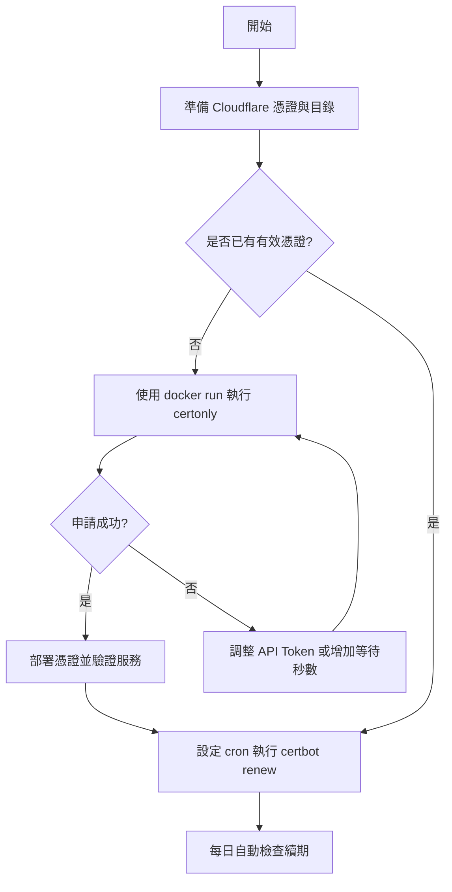

## Certbot + Cloudflare DNS 指南

本文件條列在 Docker 環境使用 `certbot/dns-cloudflare` 申請與續期憑證的完整流程，搭配流程圖與目錄方便快速定位。

---

### 流程圖


---

### 目錄
1. [環境與檔案結構](#1-環境與檔案結構)
2. [準備憑證前置作業](#2-準備憑證前置作業)
3. [申請 Wildcard 憑證](#3-申請-wildcard-憑證)
4. [其他常見情境](#4-其他常見情境)
5. [續期設定](#5-續期設定)
6. [注意事項](#6-注意事項)
7. [acme.sh 替代方案（可選）](#7-acmesh-替代方案可選)

---

### 1. 環境與檔案結構
- `cloudflare.ini.example`：Cloudflare 認證資訊範本。
- `certs/`：憑證輸出位置（映射到容器內的 `/etc/letsencrypt`）。
- `certs-lib/`：Certbot 工作資料（映射到容器內的 `/var/lib/letsencrypt`）。

若目錄不存在，可在主機上執行：
```bash
mkdir -p /opt/certbot/certs /opt/certbot/certs-lib
```

---

### 2. 準備憑證前置作業
1. 複製範本並設定權限：
   ```bash
   cp cloudflare.ini.example cloudflare.ini
   chmod 600 cloudflare.ini
   ```
2. 依需求設定 Cloudflare 認證：
   - **建議**：使用具備 `Zone → DNS → Edit` 權限的 API Token
     ```ini
     dns_cloudflare_api_token = your_cloudflare_api_token
     ```
   - **備選**：使用 Global API Key
     ```ini
     dns_cloudflare_email = your_email@example.com
     dns_cloudflare_api_key = your_global_api_key
     ```
3. 將 `cloudflare.ini` 存放於 `/opt/certbot/cloudflare.ini`，並確保權限保持 600。

---

### 3. 申請 Wildcard 憑證
```bash
docker run -it --rm \
  -v "/opt/certbot/certs:/etc/letsencrypt" \
  -v "/opt/certbot/certs-lib:/var/lib/letsencrypt" \
  -v "/opt/certbot/cloudflare.ini:/cloudflare.ini" \
  certbot/dns-cloudflare certonly \
  --dns-cloudflare \
  --dns-cloudflare-credentials /cloudflare.ini \
  --dns-cloudflare-propagation-seconds 120 \
  -d yourdomain.com -d '*.yourdomain.com'
```

申請成功後，憑證與私鑰會位於 `/opt/certbot/certs/live/yourdomain.com/`：
- `fullchain.pem`：完整憑證鏈
- `privkey.pem`：私鑰

---

### 4. 其他常見情境
- **只申請單一子網域**
  ```bash
  docker run -it --rm \
    -v "/opt/certbot/certs:/etc/letsencrypt" \
    -v "/opt/certbot/certs-lib:/var/lib/letsencrypt" \
    -v "/opt/certbot/cloudflare.ini:/cloudflare.ini" \
    certbot/dns-cloudflare certonly \
    --dns-cloudflare \
    --dns-cloudflare-credentials /cloudflare.ini \
    --dns-cloudflare-propagation-seconds 120 \
    -d app.yourdomain.com
  ```
- **調整等待時間**：視 DNS 佈署速度變更 `--dns-cloudflare-propagation-seconds` 數值。
- **多網域大量申請**：可將指令整理為腳本或批次工具，依序執行多組網域參數。

---

### 5. 續期設定
首發憑證成功後，再設定排程定期執行 `certbot renew`：

1. 先手動測試續期指令是否成功：

```bash
docker run -it --rm \
  -v "/opt/certbot/certs:/etc/letsencrypt" \
  -v "/opt/certbot/certs-lib:/var/lib/letsencrypt" \
  -v "/opt/certbot/cloudflare.ini:/cloudflare.ini" \
  certbot/dns-cloudflare renew
```

2. 若上述指令成功，透過 `crontab -e` 新增排程。例如每天凌晨 03:30 執行：

```cron
30 3 * * * docker run --rm -v /opt/certbot/certs:/etc/letsencrypt -v /opt/certbot/certs-lib:/var/lib/letsencrypt -v /opt/certbot/cloudflare.ini:/cloudflare.ini certbot/dns-cloudflare renew >> /var/log/certbot-renew.log 2>&1
```

> 若系統顯示 `crontab: command not found`，請先安裝並啟用 cron（Debian/Ubuntu 範例：`sudo apt update && sudo apt install -y cron && sudo systemctl enable --now cron`）。

Let’s Encrypt 憑證有效期為 90 天；`certbot renew` 只會在距離到期 30 天內才真正更新，因此每日排程執行不會造成頻繁發證。

---

### 6. 注意事項
- 確保 Cloudflare DNS 已建立對應記錄（必要時暫時調整為 `DNS only`）。
- 驗證期間 certbot 會自動建立 `_acme-challenge.xxx` TXT 記錄，完成後會移除。
- 若遇到 `No TXT record found`，可增加等待秒數或檢查 API Token 權限。
- 建議定期檢查 `/var/log/certbot-renew.log`，確保續期流程無誤。
---

### 7. acme.sh 替代方案（可選）
若希望改用輕量化的 `acme.sh` 搭配 Cloudflare DNS，也可透過官方 Docker 映像完成。以下流程與上方 Certbot 方式互斥，請選其一維護即可。

1. **建立資料目錄**：
   ```bash
   mkdir -p /opt/acme.sh
   chmod 700 /opt/acme.sh
   ```

2. **準備 Cloudflare 憑證**  
   - API Token（建議）：需具備 `Zone → DNS → Edit` 權限，於執行時以 `-e CF_Token="your_token"` 傳入。
   - Global API Key：以 `-e CF_Key="your_global_key" -e CF_Email="your_email@example.com"` 傳入。

3. **首次註冊（可選，但建議）**：
   ```bash
   docker run --rm -it \
     -v "/opt/acme.sh:/acme.sh" \
     neilpang/acme.sh --register-account -m your_email@example.com
   ```

4. **申請 Wildcard 憑證**：
   ```bash
   docker run --rm -it \
     -v "/opt/acme.sh:/acme.sh" \
     -e CF_Token="your_cloudflare_token" \
     neilpang/acme.sh --issue \
     --dns dns_cf \
     -d yourdomain.com \
     -d "*.yourdomain.com"
   ```

   憑證會位於 `/opt/acme.sh/yourdomain.com/`：
   - `fullchain.cer`
   - `yourdomain.com.key`

5. **部署到固定路徑（選擇性）**：使用 `--install-cert` 讓 acme.sh 自動複製檔案到指定位置，便於服務掛載：
   ```bash
   docker run --rm -it \
     -v "/opt/acme.sh:/acme.sh" \
     neilpang/acme.sh --install-cert -d yourdomain.com \
     --cert-file      /opt/acme.sh/deploy/yourdomain.com.crt \
     --key-file       /opt/acme.sh/deploy/yourdomain.com.key \
     --fullchain-file /opt/acme.sh/deploy/yourdomain.com.fullchain.pem
   ```

6. **設定續期排程**：acme.sh 會在執行 `--cron` 時檢查所有已申請的網域。確保命令能成功後，再寫入 crontab。

   ```bash
   docker run --rm \
     -v "/opt/acme.sh:/acme.sh" \
     -e CF_Token="your_cloudflare_token" \
     neilpang/acme.sh --cron
   ```

   ```cron
   15 3 * * * docker run --rm -v /opt/acme.sh:/acme.sh -e CF_Token="your_cloudflare_token" neilpang/acme.sh --cron >> /var/log/acme-cron.log 2>&1
   ```

> 若使用 Global API Key，將上述命令中的 `-e CF_Token=...` 改為同時傳入 `-e CF_Key=... -e CF_Email=...`。


### 8. 自動化腳本

為了簡化流程，我們提供了一個互動式腳本 `bootstrap-certificates.sh`，可協助您自動完成 Certbot 或 acme.sh 的設定與首次申請。

1. **下載腳本**：
   ```bash
   bash -c "$(curl -fsSL https://raw.githubusercontent.com/TW199501/docker-operation/main/certbot/bootstrap-certificates.sh)"
   ```

2. **執行腳本**：
   ```bash
   ./bootstrap-certificates.sh
   ```

腳本會引導您輸入網域、Cloudflare 憑證等資訊，並自動建立目錄、申請憑證、設定續期排程。請確保 Docker 已安裝並執行中。
