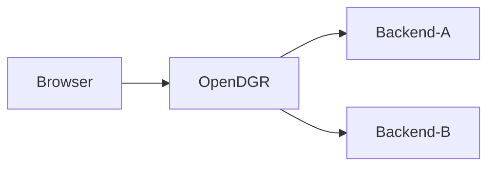

[![][tpi-logo]][tpi-url]
# digiRunner: Mission-Critical API Gateway & Management for Microservices
[TPI.dev](https://tpi.dev) | [Documentation](https://docs.tpi.dev/) | [Blog](https://tpi.dev/blog) | [Community](https://github.com/TPIsoftwareOSPO/digiRunner-Open-Source/discussions)
## Table of contents
- [Overview](#overview)
- [Quick Start](#quick-start)
  - [Using Container](#1-using-container)
    - [Option 1: Docker](#option-1-docker)
    - [Option 2: Docker-Compose](#option-2-docker-compose)
    - [Option 3: Kubernetes](#option-3-kubernetes)
    - [Option 4: Helm](#option-4-helm)
  - [Run digiRunner Instantly on Your Local Machine](#2-run-digirunner-instantly-on-your-local-machine)
  - [Run Your Own Build](#3-run-your-own-build)
- [Create a Simple Api Proxy](#create-a-simple-api-proxy)
- [Documentation](#documentation)
- [Build Your Own JAR](#build-your-own-jar)
- [Run digiRunner in a Local Container Registry](#run-digirunner-in-a-local-container-registry)

## Overview

Welcome to digiRunner, the mission-critical, open-source API management platform purpose-built to help developers tame complexity, enforce security, and streamline API operations—without the bloat or barriers.
Whether you're launching your first microservice or governing dozens of API endpoints in a production-critical environment, digiRunner makes modern API management simple, scalable, and reliable where it matters most.

## What Makes digiRunner Different?

Managing APIs across services, teams, and environments can be messy—especially when uptime, performance, and security are non-negotiable. digiRunner fixes that with a streamlined control plane and tools that just make sense.
With digiRunner, you can:

•	✅ Route API requests intelligently and dynamically

•	✅ Secure APIs using OAuth2, OIDC, RBAC, and token-based flows

•	✅ Apply rate limits, traffic shaping, and quotas effortlessly

•	✅ Monitor real-time usage, latency, and anomalies

All with a clean UI, strong defaults, and smart documentation that scales with your mission-critical systems.

## Solving Real API Challenges

| **Challenge**                             | **digiRunner Solution**                                                                  |
|-------------------------------------------|------------------------------------------------------------------------------------------|
| Inconsistent access control               | Visual RBAC, API keys, OAuth2 & OIDC support                                             |
| Disorganized microservice endpoints       | Unified API Gateway with intelligent routing                                             |
| High learning curve for devs & ops        | UI-driven config + AI-powered documentation                                              |
| Siloed logs and monitoring gaps           | Built-in dashboards and real-time analytics                                              |
| Slow APIs dragging down overall system performance.        | Intelligent traffic shaping with "Fast Lanes" prioritizes fast APIs, preventing system bottlenecks.              |
| Limited visibility into performance       | Track API performance and catch anomalies before users do                                |
| Lack of scalability and governance        | Build API-first apps with policy-based traffic control and enterprise-grade security     |


## Key Features

- Smart Routing Engine – Route API traffic based on URL paths, headers, query parameters, and other request metadata. Supports dynamic and conditional routing logic for microservices, legacy systems, and multi-version APIs.

- Intelligent Non-Blocking Traffic Dispatching – With simple configurations, digiRunner intelligently distributes traffic across optimal routes, even in the event of API congestion or backend latency. This ensures system stability, minimizes bottlenecks, and improves responsiveness during peak loads.

- Real-Time Monitoring Dashboard – Monitor live request metrics, error rates, and latency with a rich, visual dashboard. Interactive indicators and customizable alerts enable early issue detection and faster resolution—empowering teams to collaborate efficiently and maintain system health in real time.

- Role-Based Access Control (RBAC) – Set granular access policies per user, team, or role. Combine this with API key authentication or OAuth2/OIDC to ensure only the right consumers can access your APIs.

- Rate Limiting & Quotas – Define limits on request rates per consumer, application, or endpoint. Enforce burst limits, sustained usage thresholds, and usage quotas to maintain reliability under high load.

- Token-based Auth – Seamlessly integrate secure authentication flows using OAuth2, OpenID Connect (OIDC), and static API keys. Supports multi-tenant identity providers for enterprise use cases.

- Easy Setup – Deploy digiRunner anywhere—locally for development, in Docker containers for portability, or on cloud platforms for production-scale infrastructure. Configuration is UI-driven with CLI support.

## Where digiRunner Fits: Real-World Scenarios

digiRunner empowers teams across industries to implement mission-critical API management use cases with ease:

•	Financial Services – Enforce security standards and control access to customer transaction APIs across digital banking and fintech ecosystems.

•	Retail & E-commerce – Manage catalog, inventory, and checkout APIs with built-in rate limiting, version control, and monitoring during high-traffic seasons.

•	Healthcare & Insurance – Govern sensitive API endpoints with fine-grained access policies, audit trails.

•	Software & SaaS Providers – Offer a scalable and secure API layer to partners and developers with clear documentation and usage analytics.

•	Government & Public Sector – Unify legacy and modern service APIs under a single gateway to simplify external integrations and ensure compliance.

These use cases build on digiRunner’s core strengths in observability, scalability, and governance—giving teams a stable foundation for growth and agility.


## Service Structure



## Quick Start

> Before installing digiRunner, make sure your machine meets the following minimum system requirements:
>
> * CPU >= 2 Core
>
> * RAM >= 4 GiB

### 1. Using Container

choose one of the following options to launch service by container

#### Option 1: Docker

```shell
docker run -it -d -p 31080:18080 tpisoftwareopensource/digirunner-open-source
```

#### Option 2: Docker-Compose

> Based on the content of [deploys/docker-compose/docker-compose.yml](deploys/docker-compose/docker-compose.yml)

```yml
name: digirunner-open-source
services:
    dgr:
        image: tpisoftwareopensource/digirunner-open-source
        ports:
            - "31080:18080"
        environment:
            - TZ=Asia/Taipei
```

- save above configuration to `opendgr-compose.yml`
- run `docker-compose -f opendgr-compose.yml up -d` at the same directory with `opendgr-compose.yml`

#### Option 3: Kubernetes

> Based on the content of [deploys/kubernetes/digirunner-open-source.yml](deploys/kubernetes/digirunner-open-source.yml)


```yml
apiVersion: v1
kind: Service
metadata:
  name: digirunner-open-source-svc
spec:
  ports:
    - name: tcp
      nodePort: 31080
      port: 18080
      protocol: TCP
      targetPort: 18080
  selector:
    app: digirunner
  sessionAffinity: None
  type: NodePort

---

apiVersion: apps/v1
kind: Deployment
metadata:
  labels:
    app: digirunner
  name: digirunner-open-source-deploy
spec:
  replicas: 1
  selector:
    matchLabels:
      app: digirunner
  template:
    metadata:
      labels:
        app: digirunner
      namespace: digirunner-open-source-ns
    spec:
      containers:
        - env:
            - name: TZ
              value: Asia/Taipei
          image: tpisoftwareopensource/digirunner-open-source
          imagePullPolicy: Always
          name: digirunner
          ports:
            - containerPort: 18080
              name: tcp
              protocol: TCP
          workingDir: /opt/digirunner
```

- save above configuration to `digirunner-open-source.yml`
- run `kubectl apply -f digirunner-open-source.yml`

#### Option 4: Helm

Contributions:

- **[how-to-package-digirunner-using-helm](https://github.com/vulcanshen-tpi/how-to-package-digirunner-using-helm)**
  - Step-by-step guide on how to package the digirunner open source project using Helm.
  - Quickly install the example

#### Connect to service

- Open your browser and navigate to: http://localhost:31080/dgrv4/login
- Use the default credentials to login: 
  - username: `manager`
  - password: `manager123`
---


### 2. Run digiRunner Instantly on Your Local Machine

If you want to **try digiRunner quickly without installation or setup**, you can use our pre-packaged version for your operating system.

#### 🧩 Step 1. Download the Package
Choose your OS and download the corresponding file from the [release](https://github.com/TPIsoftwareOSPO/digiRunner-Open-Source/releases/):

- **macOS (ARM64):** [`digirunner-opensource-macos-arm64-vX.X.X.X(version).zip`]  
- **Windows (AMD64):** [`digirunner-opensource-windows-amd64-vX.X.X.X(version).zip`]
  
#### ⚙️ Step 2. Extract and Run
1. Unzip the downloaded package.  
2. Open the extracted folder.  
3. Double-click **`quickstart.exe`** to launch digiRunner on your local machine.  

You can now start exploring digiRunner immediately — no installation, no configuration required!

#### 🌐 Step 3. Access digiRunner in Your Browser
After launching digiRunner, open your browser and go to:

👉 [http://localhost:18080/dgrv4/login](http://localhost:18080/dgrv4/login)

Use the following default credentials to log in:

```

username: manager
password: manager123

```

Once logged in, you can start exploring digiRunner’s management console and test its features locally.

#### ⚠️ Note
You may receive a **security or firewall warning** from macOS or Windows when you run the file for the first time.  
This is because we haven’t yet registered with Apple or Microsoft developer programs.  

> Simply **allow or bypass the warning** (e.g., “Keep Anyway” / “Allow app to run”) to continue.  
> Once launched, digiRunner will run safely and locally on your machine.

#### 🧹 Step 4. Clean Up
After testing, you can simply **delete the entire extracted folder** — digiRunner does not modify or install anything on your system.

---

This Quickstart version is ideal for users who want to:
- Test digiRunner locally in just a few minutes  
- Explore API management features without setup overhead  
- Safely remove everything after testing  

Enjoy your hands-on experience with digiRunner! 💡


### 3. Run Your Own Build

### Pre-requisites

- OpenJDK 21

---

1. Clone the repository: 
    ```sh
    git clone https://github.com/TPIsoftwareOSPO/digiRunner-Open-Source.git
    ```
2. Change directory:
    ```shell
    cd digiRunner-Open-Source/
    ```
3. Run the service:
    ```sh
    ./gradlew :dgrv4_Gateway_serv:bootRun
    ```

4. Wait for the digiRunner banner to appear.

 ```
      _       ____                                      _  _   
   __| | __ _|  _ \ _   _ _ __  _ __   ___ _ __  __   __ || |  
  / _` |/ _` | |_) | | | | '_ \| '_ \ / _ \ '__| \ \ / / || |_ 
 | (_| | (_| |  _ <| |_| | | | | | | |  __/ |     \ V /|__   _|
  \__,_|\__, |_| \_\\__,_|_| |_|_| |_|\___|_|      \_/    |_|  
        |___/                                                  
========== dgRv4 web server info ============
...
```

5. Open your browser and navigate to: http://localhost:18080/dgrv4/login
6. Use the default credentials to login: 
   - username: `manager`
   - password: `manager123`

## Create a Simple API Proxy

- [Documentation/create_a_simple_api_proxy](https://docs.tpi.dev/get-started/registering-your-first-apis-with-digirunner)

## Documentation

- [Documentation](https://docs.tpi.dev/)

## Build Your Own JAR

1. Change to digiRunner directory:
    ```sh
    cd digiRunner/
    ```
2. Build the JAR: 
    ```sh
    ./gradlew :dgrv4_Gateway_serv:clean :dgrv4_Gateway_serv:bootJar
    ```
   
3. Locate the JAR file: `dgrv4_Gateway_serv/build/libs/digiRunner-{version}.jar`
4. Run the JAR:
    ```sh
    java -jar dgrv4_Gateway_serv/build/libs/digiRunner-{version}.jar --digiRunner.token.key-store.path=$PWD/dgrv4_Gateway_serv/keys
    ```

## Run digiRunner in a Local Container Registry

### 1. Build the Image

#### Change to digiRunner directory:

```sh
cd digiRunner/
```
#### Build the Docker image:

```sh
docker build -t digirunner .
```

### 2. Run the container

```sh
docker run -p 18080:18080 digirunner
```

Open your browser and navigate to: http://localhost:18080/dgrv4/login


[tpi-url]: https://tpi.dev/
[tpi-logo]: /digiRunner.png

