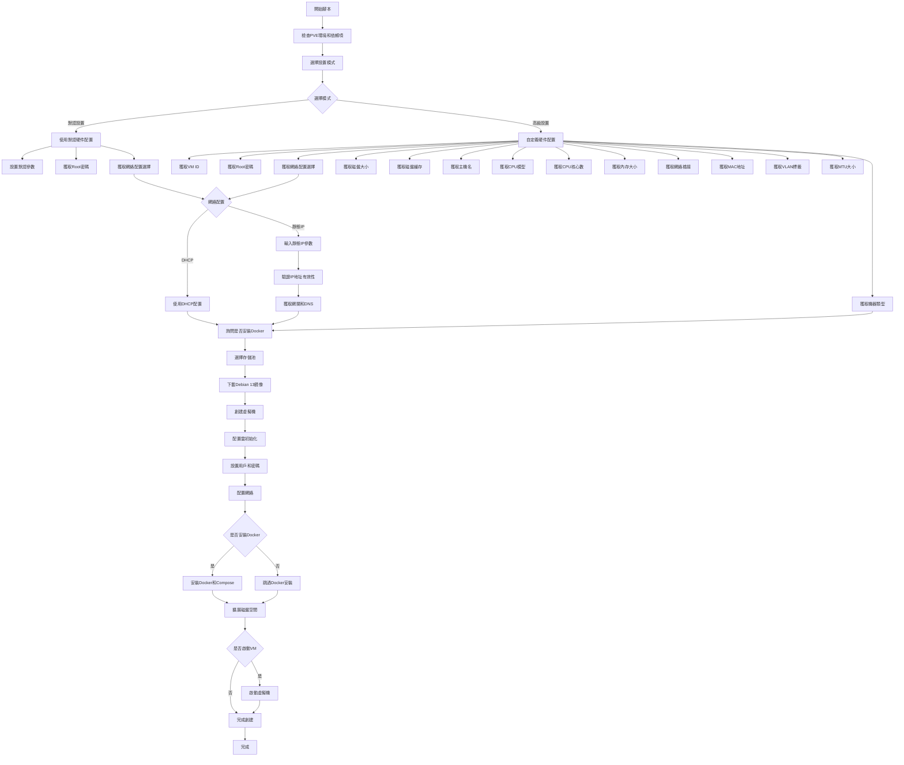

## Proxmox8.0-9.0 VM 虛擬機自動化腳本

### Debian 13

此腳本用於在 Proxmox VE 8.0-9.0 上自動創建 Debian 13 虛擬機。

### 腳本流程

腳本提供兩種配置模式：

#### 默認模式
默認模式使用預定義的硬件配置創建虛擬機：
- 虛擬機ID：自動分配
- 機器類型：i440fx
- 磁盤大小：10G
- 磁盤緩存：None
- 主機名：debian
- CPU模型：KVM64
- CPU核心數：2
- 內存大小：2048 MiB
- 網絡橋接：vmbr0
- MAC地址：自動生成
- VLAN：Default
- MTU大小：Default
- 啟動選項：創建完成後自動啟動

在默認模式下，用戶仍可以選擇：
1. **Root密碼** - 設置root用戶密碼
2. **網絡配置** - 選擇使用DHCP或靜態IP配置
3. **Docker安裝** - 選擇是否安裝Docker和Docker Compose

#### 自定義模式
自定義模式允許用戶完全自定義所有配置參數。



### 使用方法

1. 下載安裝腳本

```bash
bash -c "$(curl -fsSL https://raw.githubusercontent.com/TW199501/docker-operation/main/proxmox9.0/debian13-vm.sh)"
```

2. 執行安裝 SSH

```bash
sudo apt update && sudo apt install -y openssh-client openssh-server
passwd root
sed -i -e 's/#PermitRootLogin prohibit-password/PermitRootLogin yes/g' -e 's/^PasswordAuthentication.*/PasswordAuthentication yes/' /etc/ssh/sshd_config
ssh-keygen -A
systemctl restart sshd
```

3. 把硬碟擴大

```bash
sudo apt update && sudo apt install -y cloud-guest-utils
sudo growpart /dev/sda 1
sudo resize2fs /dev/sda1
```
