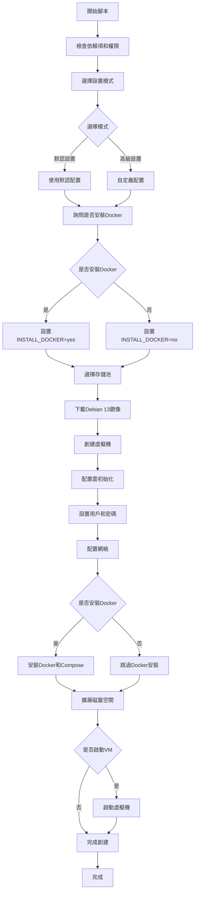

## Proxmox8.0-9.0 VM 虛擬機自動化腳本

### Debian 13

此腳本用於在 Proxmox VE 8.0-9.0 上自動創建 Debian 13 虛擬機。

### 腳本流程



### 使用方法

1. 下載安裝腳本

```bash
bash -c "$(curl -fsSL https://raw.githubusercontent.com/TW199501/docker-operation/main/proxmox9.0/debian13-docker-vm.sh)"
```

2. 執行安裝 SSH

```bash
sudo apt update && sudo apt install -y openssh-client openssh-server
passwd root
sed -i -e 's/#PermitRootLogin prohibit-password/PermitRootLogin yes/g' -e 's/^PasswordAuthentication.*/PasswordAuthentication yes/' /etc/ssh/sshd_config
ssh-keygen -A
systemctl restart sshd
```

3. 把硬碟擴大

```bash
sudo apt update && sudo apt install -y cloud-guest-utils
sudo growpart /dev/sda 1
sudo resize2fs /dev/sda1
```
